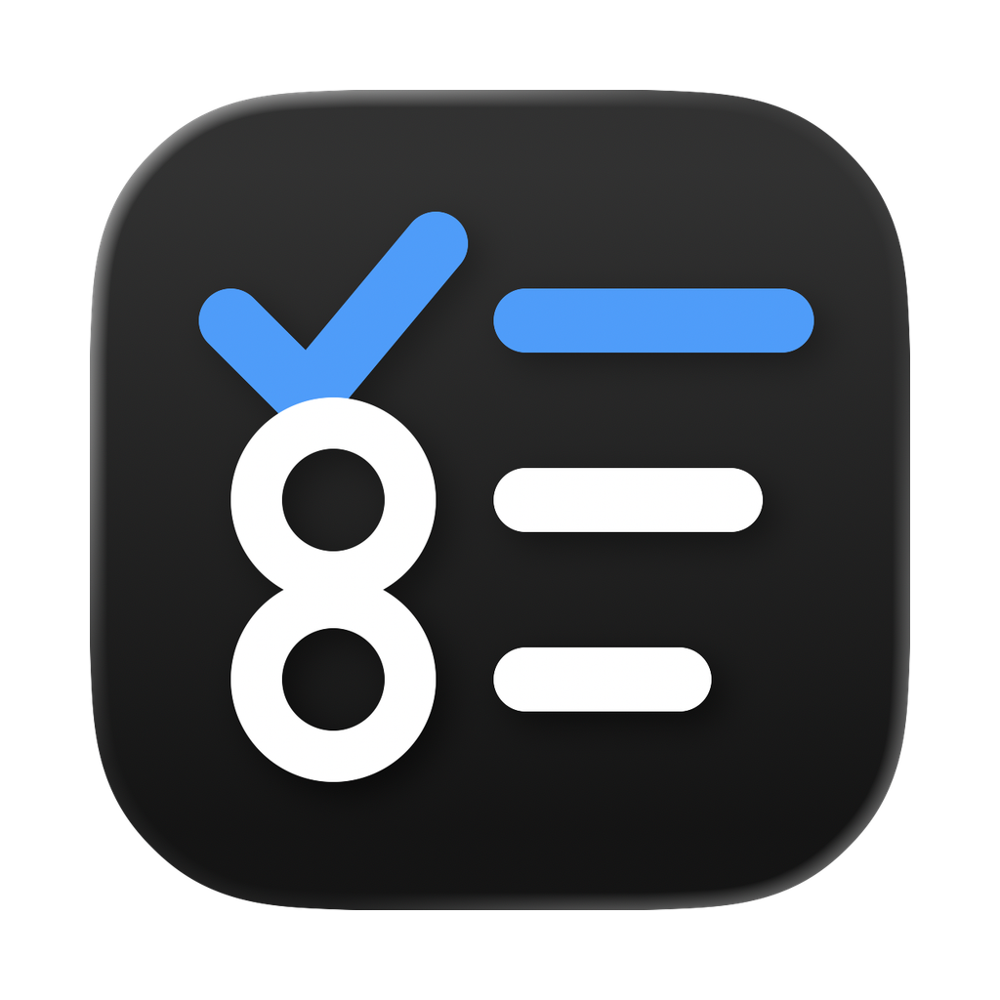

# Task OS

A personal task management system built for people who work with Claude. Tasks live in a local SQLite database. Claude connects via MCP and can create, update, triage, and act on tasks directly. An Electron app provides the UI.



---

## Install

Download the latest release for your platform from the [Releases page](https://github.com/pirateandfox/task-os/releases/latest):

- **Mac** — `.dmg` (arm64 for Apple Silicon, x64 for Intel)
- **Windows** — `.exe` installer (unsigned — Windows will show a SmartScreen warning, click "More info" → "Run anyway")
  - Claude Code on Windows: use `npm install -g @anthropic-ai/claude-code` if the native installer fails (required on CPUs without AVX support)
- **Linux** — `.AppImage` (make executable with `chmod +x`, then run)

---

## Run from Source

Requires Node.js 20+.

```bash
git clone https://github.com/pirateandfox/task-os.git
cd task-os
npm install
npm install --prefix ui
npm run electron-dev
```

---

## Connect Claude Code

Task OS runs an MCP server on `http://localhost:3457`. Add it to your `~/.claude.json`:

```json
{
  "mcpServers": {
    "task-os": {
      "type": "http",
      "url": "http://localhost:3457/mcp"
    }
  }
}
```

Restart Claude Code after adding it. The Task OS app must be running for the MCP tools to be available.

You can also change the port and auto-update `~/.claude.json` from Settings → MCP Server inside the app.

---

## Views

The app has four main views, selectable from the top-right toggle:

| View | Description |
|---|---|
| **Priority** | All of today's tasks grouped by context, sorted by `sort_order` (drag to reorder) |
| **Project** | Same tasks grouped by project instead |
| **Backlog** | All snoozed, unsurfaced, and future tasks |
| **Habits** | Daily habit tracker |

Use the date navigator in the top bar to view tasks for other days.

---

## Task Fields

| Field | Description |
|---|---|
| **Title** | The task description |
| **Status** | `active`, `snoozed`, `done`, `archived` |
| **Context** | Which area of your life/work this belongs to (e.g. `personal`, `monroe`, `silvermouse`) |
| **Project** | Optional grouping within a context |
| **Due Date** | When the task is due — overdue tasks appear in red |
| **Priority** | `p1`–`p4` for ordering within a section |
| **Energy** | `high`, `medium`, `low` — helps pick tasks for your current state |
| **Type** | `task`, `event`, `reminder` — events are permanent dated records |
| **Recurrence** | RRULE string (e.g. `FREQ=WEEKLY;BYDAY=MO`) or shorthand (`daily`, `weekdays`, `weekly`, `monthly`) |
| **Notes** | Free-text thread; supports multi-message history with user/agent attribution |

---

## Contexts

Contexts represent different areas of your life or work. Each task belongs to one context. Contexts have a display label and a color dot.

Manage contexts in **Settings → Contexts**: add, edit label/color, or delete. Default contexts: `personal`, `monroe`, `biztobiz`, `pirateandfox`, `silvermouse`, `flightdesk`, `internal`.

Claude uses contexts to organize tasks when triaging: `list_contexts` to see all, `create_task` with a `context` field to assign one.

---

## Daily Note

The daily note is a per-day scratchpad (monospace text). Open it with the **✎** button in the header or by pressing the button. Claude can also read and append to it via `get_daily_note` and `update_daily_note`.

---

## Habits

The Habits view tracks repeating behaviors. Each habit has a title, optional description, and a recurrence rule. You can mark habits done or skipped, add notes per log entry, and see a streak dot display.

Claude can log habits via `log_habit` and read history via `get_habit_history`.

---

## Keyboard Shortcuts

| Key | Action |
|---|---|
| `N` | New task (when not in an input) |
| `R` | Refresh task list |
| `Ctrl + \`` | Toggle terminal |
| `Escape` | Close detail panel / modal |

---

## Settings

Open Settings from the **⚙** gear icon in the header.

### Appearance

Choose between **System** (follows your OS dark/light preference), **Light**, or **Dark** mode. The header also has a ◑/☀/☾ button that cycles through modes.

**Color Tokens** — customize any of the 9 theme tokens with a color picker:

| Token | Controls |
|---|---|
| Background | Main window background |
| Surface | Cards, header bar |
| Surface Alt | Inputs, secondary fills |
| Border | All dividers and outlines |
| Text | Primary text |
| Muted Text | Labels, metadata, placeholders |
| Accent | Interactive elements, selected states, links |
| Panel Background | Sliding panels (terminal, settings, daily note) |
| Input Background | Text inputs |

Use **Reset to Dark** / **Reset to Light** to apply a preset, or **Reset to Preset** to discard custom overrides and return to the active preset. Theme is stored in the browser's `localStorage` — persists across restarts.

### Terminal Working Directory

Sets the working directory when the built-in terminal opens. Also the root for agent scanning (see below).

```
/Users/you/IdeaProjects        # Mac/Linux
C:\Users\you\IdeaProjects      # Windows
```

### Agents Scan Root

If you want Task OS to find agents (`agent.config` files) in a wider directory than your terminal CWD — for example, across multiple sibling repos — set this separately. Defaults to terminal working directory.

### Terminal Auto-Run Command

A command that runs automatically every time the terminal opens. Useful for activating an environment or launching a persistent session (e.g. `dangerclaude`).

### Default Agent Command

The CLI command used to invoke agents from the task queue. Defaults to `claude --dangerously-skip-permissions`. Per-agent `agent.config` overrides this.

### Attachments & Storage

Task OS can store task attachments in any S3-compatible bucket (Cloudflare R2 recommended):

- **S3 Endpoint URL** — e.g. `https://<account_id>.r2.cloudflarestorage.com`
- **Bucket Name** — e.g. `task-os-attachments`
- **Access Key ID / Secret Access Key** — R2 API token credentials
- **Public Base URL** — optional CDN prefix; if blank, presigned URLs are used
- **Local Attachment Cache** — all files are also cached here on disk

Use **Test Connection** to verify credentials, and **Sync Pending** to upload any locally-cached attachments that haven't been synced yet.

### Contexts

Add, edit, or remove contexts. Each context has a slug (e.g. `personal`), a display label, and a color.

### MCP Server

Default port is `3457`. Click **Apply** to save the new port and auto-update `~/.claude.json`. Restart Claude Code after applying.

---

## Agents

An agent is a folder with an `agent.config` file. Task OS scans your agents scan root recursively for these folders and lists discovered agents in Settings.

### agent.config format

```json
{
  "name": "My Agent",
  "description": "What this agent does",
  "command": "claude --dangerously-skip-permissions"
}
```

- `name` — display name (defaults to folder name)
- `description` — shown in Settings
- `command` — how to invoke the agent (overrides Default Agent Command)

### Assigning an agent to a task

In the task detail panel, set the **Agent** field to point to the agent's folder. Queue an agent job from the detail panel — Task OS runs the agent in that folder with the task description as the prompt. Job status (queued / running / done / failed) is shown on the task row.

---

## File Previews (Markdown & Email)

Task OS can preview `.md` files and `.eml`/HTML email files directly in the app. Agents can attach output files to a task so they appear as clickable preview buttons in the task detail panel.

### How agents should attach files

After writing a file, the agent should call `update_task` with a `links` array:

```
update_task(
  task_id: "abc123",
  links: [
    { url: "/absolute/path/to/output/document.md" },
    { url: "/absolute/path/to/output/email-draft.html" }
  ]
)
```

The file path must be absolute. Task OS reads it directly from disk when you click the preview button.

### What to tell your agents

Include this in your agent's system prompt or CLAUDE.md:

```
After writing any output files (markdown documents, email drafts, etc.),
attach them to the task using update_task with a links array containing
the absolute file path as the url. Example:

update_task(task_id: "...", links: [{ url: "/absolute/path/to/file.md" }])

This makes the file available for preview in Task OS.
```

### Supported file types

| Extension | Preview |
|---|---|
| `.md` | Markdown editor with PDF export |
| `.html`, `.eml` | Email/HTML preview with zoom |

---

## MCP Tools Reference

Key tools available to Claude:

| Tool | Description |
|---|---|
| `morning_briefing` | Full morning briefing with priorities and overdue tasks |
| `afternoon_briefing` | Mid-day check-in summary |
| `get_todays_tasks` | Today's active tasks |
| `get_overdue_tasks` | All overdue tasks |
| `get_waking_tasks` | Tasks surfacing from snooze today |
| `create_task` | Create a new task |
| `update_task` | Update any field including links, status, context, agent |
| `complete_task` | Mark a task done |
| `skip_task` | Skip a recurring task occurrence |
| `snooze_task` | Snooze until a date |
| `move_to_backlog` | Move to backlog without a surface date |
| `search_tasks` | Full-text search |
| `get_task` | Get a single task by ID |
| `get_daily_note` | Read today's daily note |
| `update_daily_note` | Append to today's daily note |
| `get_week_notes` | Read this week's daily notes |
| `list_contexts` | List all registered contexts |
| `create_context` | Register a new context |
| `queue_agent_job` | Queue an agent job for a task |
| `list_habits` | List all habits |
| `log_habit` | Log a habit as done or skipped |
| `get_habit_history` | Read habit completion history |
| `end_of_day_triage` | End-of-day review and next-day planning |
| `stale_backlog_review` | Review backlog tasks that haven't been touched recently |

---

## Contributing

### Branch protection

The `main` branch is protected — direct pushes are blocked for contributors. All changes must go through a pull request and require **1 approval** before merging.

### Workflow

```bash
# 1. Branch off main
git checkout -b feature/my-feature   # or fix/, chore/

# 2. Make changes, commit
git add <files>
git commit -m "feat: describe what you did"

# 3. Push and open a PR against main
git push -u origin feature/my-feature
gh pr create --base main
```

Use conventional commit prefixes: `feat:`, `fix:`, `chore:`, `refactor:`, `docs:`.

### What happens on merge

Merging to `main` does **not** trigger a release. Releases are cut by the maintainer by pushing a version tag:

```bash
# Maintainer only — bump version in package.json first
git tag v1.0.x && git push origin v1.0.x
```

This triggers the GitHub Actions build (macOS DMG + Windows EXE + Linux AppImage), signs/notarizes, and publishes to GitHub Releases.

### Architecture

See [`CLAUDE.md`](CLAUDE.md) for the full architecture overview, file layout, database schema, and development notes.

---

## Tech Stack

- **Electron** 41 + **Vite** + **React** + **TypeScript**
- **SQLite** via `better-sqlite3`
- **MCP** via `@modelcontextprotocol/sdk` (StreamableHTTP transport)
- **S3-compatible** attachment storage (Cloudflare R2 recommended)
- **xterm.js** for the built-in terminal

---

## License

MIT
